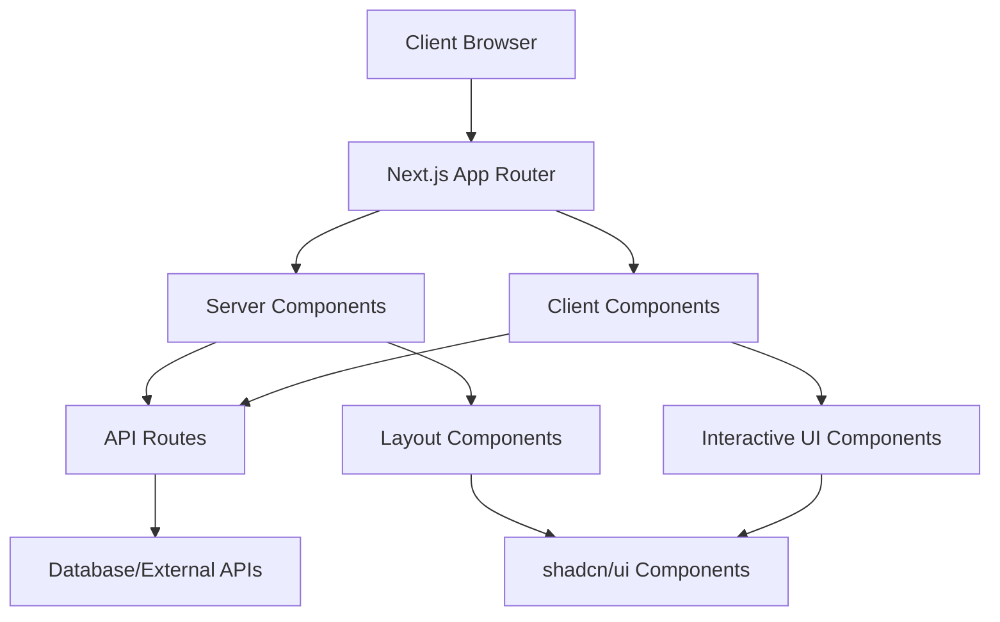
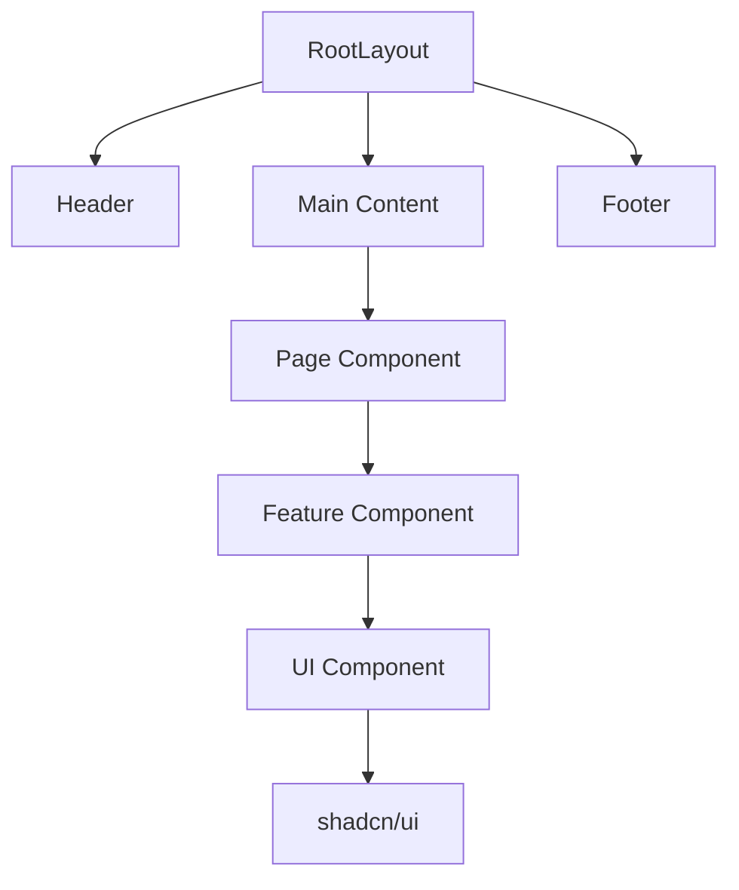
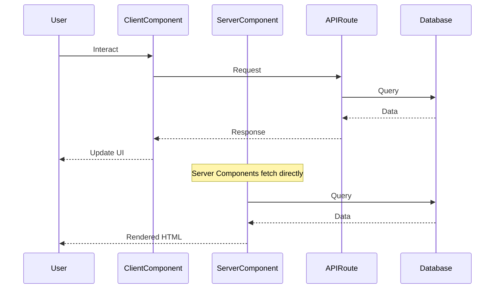
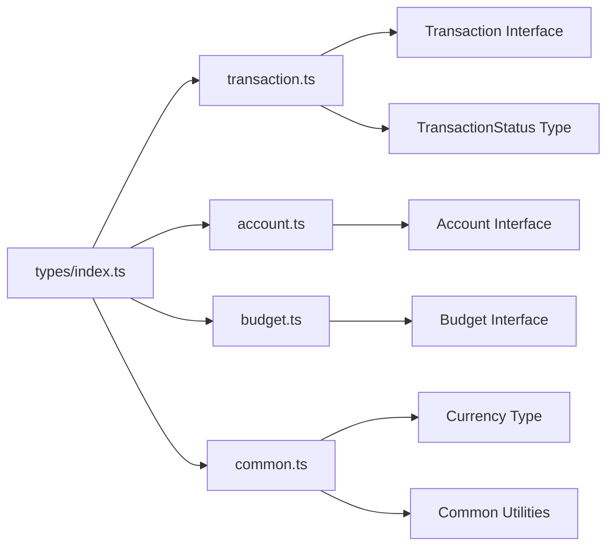
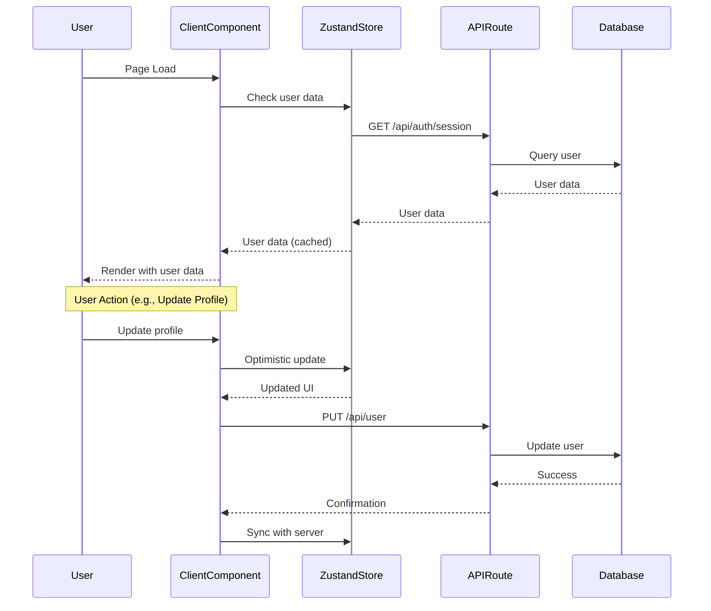
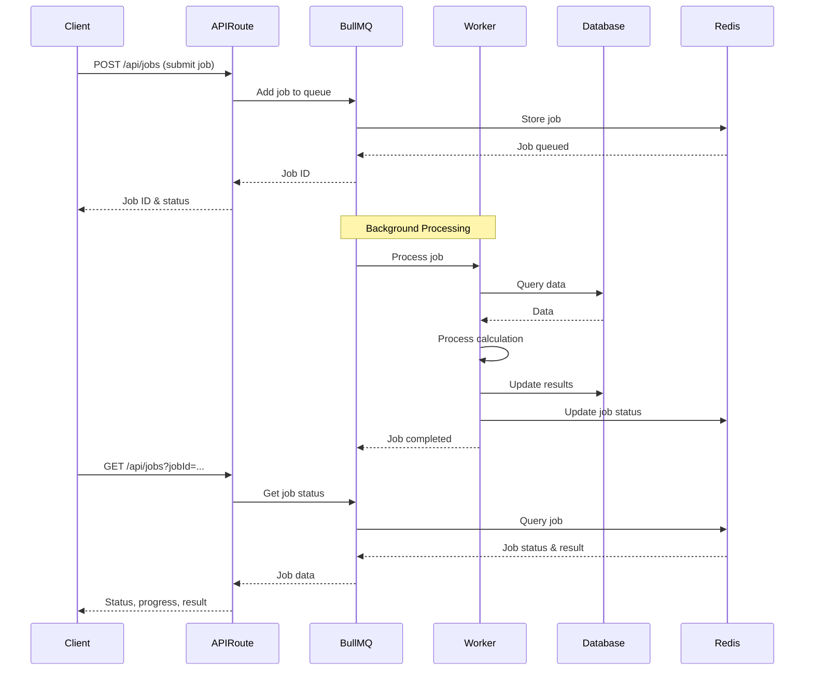

# Architecture & Coding Standards

This document serves as the **single source of truth** for all architectural decisions, coding standards, and patterns used in this financial application. **All code changes must reference this document to ensure consistency.**

## Table of Contents

1. [TypeScript Conventions](#typescript-conventions)
2. [Interface and Type Management](#interface-and-type-management)
3. [Overall Architecture](#overall-architecture)
4. [Detailed Architecture](#detailed-architecture)
5. [Coding Guidelines for AI Agents](#coding-guidelines-for-ai-agents)

---

## TypeScript Conventions

### Strict Mode

TypeScript strict mode is **required** and enabled in `tsconfig.json`:

```json
{
  "compilerOptions": {
    "strict": true
  }
}
```

### Type Safety Rules

1. **No `any` types allowed**
   - Use `unknown` when the type is truly unknown
   - Use type guards to narrow `unknown` types
   - Example:
   ```typescript
   // ❌ Bad
   function processData(data: any) { ... }
   
   // ✅ Good
   const processData = (data: unknown): void => {
     if (typeof data === 'string') {
       // Type narrowed to string
     }
   }
   ```

2. **Use `const` declarations for functions and components**
   - All functions and components must use `const` with arrow function syntax
   - Never use `function` declarations
   - **Exception**: Next.js API route handlers (`GET`, `POST`, etc.) must use `export async function` as they require named exports
   - Example:
   ```typescript
   // ❌ Bad
   function calculateTotal(amounts: number[]): number {
     return amounts.reduce((sum, amount) => sum + amount, 0)
   }
   
   // ✅ Good
   const calculateTotal = (amounts: number[]): number => {
     return amounts.reduce((sum, amount) => sum + amount, 0)
   }
   
   // ✅ Also acceptable for simple functions
   const add = (a: number, b: number): number => a + b
   ```

3. **Explicit return types for functions**
   - All functions must have explicit return types
   - Exception: Simple arrow functions where return type is obvious
   - Example:
   ```typescript
   // ✅ Good
   const calculateTotal = (amounts: number[]): number => {
     return amounts.reduce((sum, amount) => sum + amount, 0)
   }
   
   // ✅ Also acceptable for simple functions
   const add = (a: number, b: number): number => a + b
   ```

4. **Prefer `interface` for object shapes, `type` for unions/intersections**
   - Use `interface` for extensible object shapes
   - Use `type` for unions, intersections, and computed types
   - Example:
   ```typescript
   // ✅ Interface for object shape
   interface Transaction {
     id: string
     amount: number
     date: Date
   }
   
   // ✅ Type for union
   type TransactionStatus = 'pending' | 'completed' | 'failed'
   
   // ✅ Type for intersection
   type TransactionWithMetadata = Transaction & {
     metadata: Record<string, unknown>
   }
   ```

5. **Branded types for financial data**
   - Use branded types to prevent mixing different financial units
   - Example:
   ```typescript
   type Currency = string & { __brand: 'Currency' }
   type Amount = number & { __brand: 'Amount' }
   
   const createCurrency = (value: string): Currency => {
     return value as Currency
   }
   
   // This prevents accidentally mixing currencies
   const usd: Currency = createCurrency('USD')
   const eur: Currency = createCurrency('EUR')
   ```

### Type Definitions Location

- **All interfaces must be stored in the `types/` directory**
- Interface files must follow the naming convention: `[name].type.ts` (e.g., `transaction.type.ts`, `account.type.ts`)
- Domain-specific types are organized by feature
- Shared/common types are in `types/index.ts` for re-export
- Each interface file should be grouped by domain/feature and named accordingly

---

## Interface and Type Management

### Directory Structure

```
types/
├── index.ts                    # Re-exports all shared types
├── transaction.type.ts         # Transaction-related interfaces
├── account.type.ts             # Account-related interfaces
├── budget.type.ts              # Budget-related interfaces
└── common.type.ts              # Common/shared interfaces
```

**Important**: All interface files must use the `.type.ts` extension and be located in the `types/` directory.

### Naming Conventions

1. **File naming for interfaces**
   - All interface files must be in the `types/` directory
   - Interface files must use the format: `[name].type.ts`
   - Examples: `transaction.type.ts`, `account.type.ts`, `budget.type.ts`
   - Group related interfaces in the same file by domain/feature

2. **PascalCase for types and interfaces**
   - `Transaction`, `Account`, `BudgetCategory`
   - Descriptive, domain-specific names

3. **Type vs Interface naming**
   - Interfaces: `I` prefix is **not used** (e.g., `Transaction`, not `ITransaction`)
   - Types: Use descriptive names (e.g., `TransactionStatus`, `CurrencyCode`)

4. **Examples**

```typescript
// types/transaction.type.ts
export interface Transaction {
  id: string
  amount: number
  currency: Currency
  date: Date
  category: string
  description: string
  status: TransactionStatus
}

export type TransactionStatus = 'pending' | 'completed' | 'failed' | 'cancelled'

export type Currency = 'USD' | 'EUR' | 'GBP' | 'JPY'

// types/index.ts
export * from './transaction.type'
export * from './account.type'
export * from './budget.type'
export * from './common.type'
```

### Type Organization Patterns

1. **All interfaces must be in `types/` directory with `.type.ts` extension**
   - One file per domain (transaction, account, budget, etc.)
   - Related interfaces grouped together in the same file
   - File naming: `[domain].type.ts` (e.g., `transaction.type.ts`)

2. **Domain-specific types in separate files**
   - One file per domain (transaction, account, budget, etc.)
   - Related types grouped together

3. **Shared types in `types/index.ts`**
   - Re-export all types for convenient importing
   - Use `export * from './transaction.type'` pattern (note the `.type.ts` extension)

4. **Usage in components**
   ```typescript
   // ✅ Good - Import from types index
   import type { Transaction, TransactionStatus } from '@/types'
   
   // ✅ Also acceptable - Direct import
   import type { Transaction } from '@/types/transaction.type'
   ```

---

## Overall Architecture

### System Architecture



### Component Hierarchy

```
Layout Components
  └── Pages (Server Components)
      └── Feature Components (Server/Client)
          └── UI Components (shadcn/ui)
```

### Data Flow

1. **Server Components (Default)**
   - Fetch data directly
   - Render on server
   - No client-side JavaScript

2. **Client Components**
   - Marked with `'use client'`
   - Handle interactivity
   - Use hooks (useState, useEffect, etc.)

3. **API Routes**
   - Handle mutations
   - Server-side operations
   - Database interactions

### State Management

The application uses a **dual-layer state management system**:

1. **Client-Side State (Zustand)**
   - Fast user data lookups and UI state
   - Cached user profile data
   - Optimistic updates
   - Auto-hydration from server session on mount
   - Located in `lib/stores/user-store.ts`

2. **Server-Side State (Next.js API Routes)**
   - Source of truth for all data
   - Authentication and authorization
   - Database operations
   - Financial calculations
   - Always validate and sanitize inputs

3. **State Synchronization**
   - On app load: Fetch user from `/api/auth/session` and hydrate Zustand store
   - On mutations: Update Zustand optimistically, then sync with server
   - Background refresh: Periodically sync store with server (every 5-10 minutes)
   - On navigation: Re-validate with server for critical pages

**When to use each:**

- **Zustand Store**: UI state, cached user data, optimistic updates
- **Server API Routes**: Data fetching, authentication, financial calculations, database operations
- **React Hooks**: Component-local state (useState, useEffect)

### Financial Data Handling

1. **Immutability**
   - All financial data updates must be immutable
   - Use spread operators or immutable libraries

2. **Validation at Boundaries**
   - Validate all financial data at API boundaries
   - Validate user inputs before processing
   - Use Zod or similar for runtime validation

3. **Precision**
   - Use decimal.js or similar for financial calculations
   - Never use floating-point arithmetic for money
   - Example:
   ```typescript
   import Decimal from 'decimal.js'
   
   const amount1 = new Decimal('10.50')
   const amount2 = new Decimal('20.30')
   const total = amount1.plus(amount2) // 30.80
   ```

---

## Detailed Architecture

### Directory Structure

```
mrkrabs/
├── app/                      # Next.js App Router
│   ├── layout.tsx           # Root layout
│   ├── page.tsx             # Home page
│   ├── globals.css          # Global styles
│   └── [routes]/            # Route pages
├── components/              # React components
│   ├── ui/                  # shadcn/ui components
│   │   ├── button.tsx
│   │   ├── card.tsx
│   │   └── ...
│   ├── layout/              # Layout components
│   │   ├── Header.tsx
│   │   └── Footer.tsx
│   └── [feature]/           # Feature-specific components
├── lib/                     # Utilities and helpers
│   ├── utils.ts             # Utility functions (cn helper)
│   ├── stores/              # Zustand stores
│   │   └── user-store.ts    # User state management
│   └── jobs/                # Background job system
│       ├── redis.ts         # Redis connection
│       ├── queues.ts         # Job queue definitions
│       ├── workers.ts        # Background workers
│       ├── types.ts          # Job payload types
│       └── processors/       # Job processors
│           └── financial-calculations.ts
├── types/                   # TypeScript type definitions
│   ├── index.ts             # Re-exports
│   ├── transaction.type.ts  # Transaction interfaces
│   ├── account.type.ts      # Account interfaces
│   └── ...
├── public/                  # Static assets
└── [config files]           # Configuration files
```

### File Naming Conventions

1. **Components**: PascalCase (e.g., `TransactionCard.tsx`)
2. **Utilities**: camelCase (e.g., `formatCurrency.ts`)
3. **Types**: camelCase (e.g., `transaction.ts`)
4. **Pages**: Next.js App Router uses `page.tsx`, `layout.tsx`, etc.

### Import Patterns

Always use path aliases configured in `tsconfig.json`:

```typescript
// ✅ Good - Use path aliases
import { Button } from '@/components/ui/button'
import { formatCurrency } from '@/lib/utils'
import type { Transaction } from '@/types'

// ❌ Bad - Relative paths
import { Button } from '../../components/ui/button'
```

### Component Structure

Standard component structure:

```typescript
// 1. Imports (external, then internal)
import { useState } from 'react'
import { Button } from '@/components/ui/button'
import type { Transaction } from '@/types'

// 2. Props interface
interface TransactionCardProps {
  transaction: Transaction
  onEdit?: (id: string) => void
}

// 3. Component function (use const, not function)
export const TransactionCard = ({ transaction, onEdit }: TransactionCardProps): JSX.Element => {
  // Component logic
  return (
    // JSX
  )
}

// 4. Export (if needed)
export default TransactionCard
```

### API Routes Structure

When adding API routes:

```
app/
└── api/
    └── [resource]/
        └── route.ts         # API route handler
```

Example API route:

```typescript
// app/api/transactions/route.ts
import { NextRequest, NextResponse } from 'next/server'
import type { Transaction } from '@/types'

export async function GET(request: NextRequest): Promise<NextResponse> {
  // Handle GET request
  return NextResponse.json({ transactions: [] })
}

export async function POST(request: NextRequest): Promise<NextResponse> {
  // Handle POST request
  const body = await request.json()
  // Validate and process
  return NextResponse.json({ success: true })
}
```

### Server vs Client Components

**Default to Server Components** - Only use `'use client'` when necessary:

- **Server Components** (default):
  - Data fetching
  - Access backend resources
  - Keep sensitive information on server
  - Reduce client-side JavaScript

- **Client Components** (`'use client'`):
  - Interactivity (onClick, onChange, etc.)
  - Browser APIs (localStorage, window, etc.)
  - React hooks (useState, useEffect, etc.)
  - Event listeners
  - Zustand store access

---

## State Management Architecture

### Client-Side State (Zustand)

**Location**: `lib/stores/user-store.ts`

The Zustand store provides fast, client-side access to user data:

```typescript
import { useUserStore } from '@/lib/stores/user-store'

// In a component
const user = useUserStore((state) => state.user)
const setUser = useUserStore((state) => state.setUser)
const hydrate = useUserStore((state) => state.hydrate)
```

**Store Structure:**
- `user`: Current user data (`UserWithoutPassword | null`)
- `isLoading`: Loading state for async operations
- `error`: Error message if any
- `setUser`: Update user data
- `clearUser`: Clear user data (on logout)
- `updateUser`: Partial update to user data
- `hydrate`: Fetch user from server and update store

**Usage Patterns:**

1. **Hydration on Mount:**
   ```typescript
   useEffect(() => {
     if (!user && !isLoading) {
       hydrate()
     }
   }, [user, isLoading, hydrate])
   ```

2. **Optimistic Updates:**
   ```typescript
   // Update store immediately
   setUser(updatedUser)
   // Then sync with server
   await fetch('/api/user', { method: 'PUT', body: JSON.stringify(updatedUser) })
   ```

3. **On Authentication:**
   ```typescript
   // After login/signup, update store
   const response = await fetch('/api/auth/login', { ... })
   const data = await response.json()
   if (data.user) {
     setUser(data.user)
   }
   ```

### Server-Side State (API Routes)

**User Data Endpoint**: `/api/user/route.ts`

- Fetches complete user profile from database
- Includes computed fields (account summary, validation status)
- Returns cached responses with proper headers
- Always validates authentication

**Session Endpoint**: `/api/auth/session/route.ts`

- Validates current session
- Returns user data if authenticated
- Used for initial store hydration

### State Synchronization Strategy

1. **Initial Load:**
   - Server component checks auth and redirects if needed
   - Client component hydrates Zustand store from `/api/auth/session`
   - Store provides fast access for subsequent renders

2. **Mutations:**
   - Update Zustand store optimistically
   - Call API route to persist changes
   - Handle errors and rollback if needed

3. **Background Sync:**
   - Periodically refresh store (every 5-10 minutes)
   - On navigation to critical pages
   - On window focus (optional)

4. **Error Handling:**
   - Handle stale data scenarios
   - Implement retry logic for failed syncs
   - Show user-friendly error messages

---

## Background Jobs Architecture

### Overview

The application uses **BullMQ with Redis** for background job processing:

- **Long-running calculations**: Portfolio valuation, transaction aggregation
- **Scheduled tasks**: Daily reports, monthly summaries
- **Batch processing**: Data exports, bulk operations

### Architecture Components

1. **Redis Connection** (`lib/jobs/redis.ts`)
   - Centralized Redis client
   - Connection pooling and error handling
   - Graceful reconnection on failures

2. **Job Queues** (`lib/jobs/queues.ts`)
   - `financialCalculationQueue`: Financial calculations
   - `portfolioValuationQueue`: Portfolio valuations
   - `reportGenerationQueue`: Report generation

3. **Workers** (`lib/jobs/workers.ts`)
   - Process jobs from queues
   - Configurable concurrency and rate limiting
   - Error handling and retry logic

4. **Job Processors** (`lib/jobs/processors/`)
   - Domain-specific job processing logic
   - Financial calculations, data aggregation, etc.

5. **Job API** (`app/api/jobs/route.ts`)
   - Submit jobs: `POST /api/jobs`
   - Check status: `GET /api/jobs?jobId=...&type=...`

### Job Types

```typescript
type JobType =
  | 'financial-calculation'
  | 'portfolio-valuation'
  | 'transaction-aggregation'
  | 'report-generation'
  | 'data-export'
```

### Usage Example

**Submitting a Job:**
```typescript
const response = await fetch('/api/jobs', {
  method: 'POST',
  headers: { 'Content-Type': 'application/json' },
  body: JSON.stringify({
    type: 'financial-calculation',
    data: {
      calculationType: 'portfolio-value',
      userId: currentUser.userID,
    },
  }),
})

const { jobId } = await response.json()
```

**Checking Job Status:**
```typescript
const response = await fetch(`/api/jobs?jobId=${jobId}&type=financial-calculation`)
const { state, progress, result } = await response.json()
```

### Job Configuration

Each queue has configurable options:
- **Attempts**: Number of retries on failure
- **Backoff**: Retry delay strategy (exponential)
- **Concurrency**: Number of jobs processed simultaneously
- **Rate Limiting**: Max jobs per time period
- **Retention**: How long to keep completed/failed jobs

### Worker Setup

Workers are initialized in `lib/jobs/workers.ts` and should be started when the application starts. In production, workers can run in separate processes for better scalability.

**Development**: Workers run in the same process as the Next.js server
**Production**: Consider running workers in separate processes or containers

### Error Handling

- Jobs automatically retry on failure (configurable attempts)
- Failed jobs are logged with error details
- Job results include status and error messages
- Dead letter queue for permanently failed jobs (future enhancement)

---

## Coding Guidelines for AI Agents

### Before Making Code Changes

1. **Always read this file first**
   - Understand the architecture
   - Review TypeScript conventions
   - Check type organization patterns

2. **Verify existing patterns**
   - Look for similar implementations
   - Follow established patterns
   - Maintain consistency

### TypeScript Standards

1. **No `any` types**
   - Use `unknown` and type guards
   - Provide proper types for all values

2. **Explicit return types**
   - All functions should have return types
   - Helps catch errors early

3. **Proper type definitions**
   - **All interfaces must be in `types/` directory with `.type.ts` file extension**
   - Interface files must follow `[name].type.ts` naming convention
   - Use interfaces for object shapes
   - Use types for unions/intersections

### Component Standards

1. **Follow shadcn/ui patterns**
   - Use composition over configuration
   - Extend existing components
   - Maintain consistent styling

2. **Component structure**
   - Props interface first
   - Component function using `const` with arrow function syntax
   - Explicit return type
   - Clear, descriptive names

3. **Server vs Client**
   - Default to Server Components
   - Only use `'use client'` when needed
   - Minimize client-side JavaScript

### Financial Calculations

1. **Use decimal.js for precision**
   ```typescript
   import Decimal from 'decimal.js'
   
   const total = new Decimal('10.50').plus('20.30')
   ```

2. **Never use floating-point for money**
   ```typescript
   // ❌ Bad
   const total = 10.50 + 20.30 // May result in precision errors
   
   // ✅ Good
   const total = new Decimal('10.50').plus('20.30')
   ```

### Error Handling

1. **Try-catch blocks for async operations**
   ```typescript
   const fetchDataSafely = async (): Promise<Data> => {
     try {
       const result = await fetchData()
       return result
     } catch (error) {
       console.error('Failed to fetch data:', error)
       throw new Error('Data fetch failed')
     }
   }
   ```

2. **Proper error types**
   ```typescript
   class FinancialError extends Error {
     constructor(message: string, public code: string) {
       super(message)
       this.name = 'FinancialError'
     }
   }
   ```

3. **User-friendly error messages**
   - Never expose internal errors to users
   - Provide actionable error messages
   - Log detailed errors server-side

### Testing (When Added)

1. **Unit tests for utilities**
   - Test all utility functions
   - Test financial calculations thoroughly
   - Test type guards and validators

2. **Integration tests for features**
   - Test API routes
   - Test component interactions
   - Test data flow

### Code Review Checklist

Before considering code complete, verify:

- [ ] TypeScript strict mode compliance (no `any`, explicit types)
- [ ] Functions and components use `const` declarations (not `function`)
- [ ] All interfaces in `types/` directory with `.type.ts` file extension
- [ ] Interface files follow `[name].type.ts` naming convention
- [ ] Types defined in `types/` directory
- [ ] Proper import paths using `@/` aliases
- [ ] Server/Client component usage is correct
- [ ] Financial calculations use decimal.js
- [ ] Error handling is proper
- [ ] Component structure follows patterns
- [ ] No console.logs in production code
- [ ] Accessibility considerations (when applicable)
- [ ] Performance considerations (no unnecessary re-renders)
- [ ] State management: Use Zustand for client state, API routes for server state
- [ ] Background jobs: Proper job types, error handling, and status tracking
- [ ] State synchronization: Proper hydration and sync strategies

---

## Architecture Diagrams

### Component Hierarchy



### Data Flow



### Type System Organization



### State Management Flow



### Background Jobs Flow



---

## Summary

This architecture document is the **authoritative reference** for all code changes. When in doubt:

1. Read this document
2. Check existing code patterns
3. Follow established conventions
4. Maintain consistency
5. Ask for clarification if needed

**Remember**: Consistency and type safety are paramount in a financial application. Always prioritize correctness over convenience.
